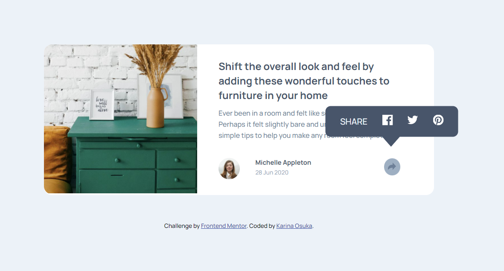

# Frontend Mentor - Article preview component solution

This is a solution to the [Article preview component challenge on Frontend Mentor](https://www.frontendmentor.io/challenges/article-preview-component-dYBN_pYFT). Frontend Mentor challenges help you improve your coding skills by building realistic projects.

### Screenshot

### Links

- Solution URL: [GitHub repository](https://github.com/kari-osk/article-preview)
- Live Site URL: [GitHub pages](https://your-live-site-url.com)

## My process

### Built with

- Semantic HTML5 markup
- CSS custom properties
- Flexbox
- CSS Grid
- Mobile-first workflow

## Author

- LinkedIn - [Karina Osuka](www.linkedin.com/in/karinaosuka)
- Frontend Mentor - [@kari-osk](https://www.frontendmentor.io/profile/kari-osk)
